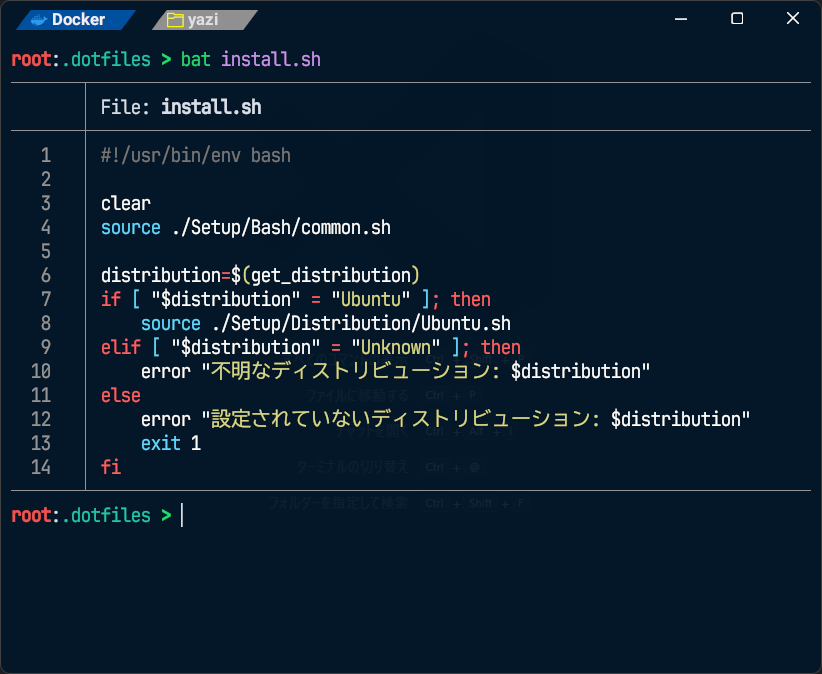

<div align="center">

# ***どっとふぁいる***
**作成途中のプロジェクト**

**Windows(winget)** / **Ubuntu(apt)**

</div>

## ❄ うぇるかむ ❄



## ☐️ TODO ☑
- [x] Windowsのインストーラーを完成させる
- [x] Ubuntu系統のインストーラーを完成させる
- [ ] メインディストリビューションを決める
- [ ] メインディストリビューションを優先的に使用する
- [ ] Githubに画像を貼る
- [ ] パッケージマネージャーpacmanに対応させる

コンフィグ周り
- [ ] Neovimの設定ファイルを修正する

## 💻 いんふぉめーしょん 💻

### 🗨️ さぽーと 💭
- Windows 11 Pro (?)
- Ubuntu
- Linux Mint
- Docker

### 📦 ぱっけーじ 📦

#### Global
- Terminal : Wezterm
- Filer : yazi
- Browser : Vivaldi / Brave
- Text Editer : edit / Micro / Neovim
- Code Editor : Visual Studio Code / Neovim / Micro
- Music Player : Neiro / mpv
- Video Player : mpv
- Minecraft Launcher : MultiMC

#### Global(Linux)
- Shell : zsh + Starship / bash

#### Programming Language
- Program Manager : mise
  - Rust : rustup
  - Python : uv
  - Java : Open JDK
- C/C++ : cl / clang / gcc
- C# : .NET
- Godot : GDScript

#### OS

##### Windows
- Package Manager : winget
- Shell : Powershell 7
- Terminal : **Global** / Windows Terminal
- Filer : File Explorer / **Global**
- Launcher : PowerToys
- Text Editer : メモ帳 / **Global**
- Code Editer : **Global** / サクラエディタ
- Music Player : メディアプレーヤー / **Global**
- Video Player : メディアプレーヤー / **Global**
- Minecraft Launcher : **Global** / Minecraft Launcher
- C/C++ : cl

##### Linux Mint
- Window Manager : Cinnamon
- Package Manager : apt

## ✿ せっとあっぷ ✿

### 実行方法

**Dotfilesを`$HOME`に設置**し、**`$HOME/.dotfiles`で起動する**ことを前提としています。

```bash
git clone https://github.com/c0b23092db/dotfiles ~/.dotfiles
cd ~/.dotfiles
bash install.sh
```

```powershell
.\Windows11.ps1 <option>
```
- `-run` : セットアップ
- `-dryrun` : 予行セットアップ
- `-debug` : デバッグ情報を表示
- `-help` : ヘルプを表示

もしくは、**対応するディストリビューションもしくはベースとなったディストリビューションを直接起動**してください。

```bash
bash Setup/Distribution/Ubuntu.sh
```

または、`Python`にある`main.py`を直接実行してください。事前に`uv init`、`uv add -r requirements.txt`を行っている必要があります。
こちらから実行する場合、指定できる引数が増加します。

- `-h`,`--help`    : show this help message and exit
- `--debug`        : デバッグ情報を表示
- `--run`          : セットアップを実行
- `-d`,`--dry-run` : 予行演習を実行
- `-p`,`--package` : 使用するパッケージを選択 [`winget`,`brew`,`apt`,`pacman`,`dnf`,`nix`]

以下は`main.py`には設定されているものの、効力を発揮しないオプションです。
- `-s`,`--shell`   : Shellを選択する [`Powershell 7`,`Bash`,`zsh`,`fish`]
- `-o`,`--os`      : OSを選択する

### フォント
必須フォントは以下の通りです。
- [UDEV Gothic](https://github.com/yuru7/udev-gothic)

もし、違うフォントを使う場合は`wezterm/config/font.lua`の該当部分を変更してください。
```lua:font.lua
    "UDEV Gothic JPDOC",{weight="Regular",stretch="Normal",italic=false}
```
その他のフォントは[URL_Font_standard-sub.txt](./Resource/URL/URL_Font_standard-sub.txt)に掲載してます。

## ⚙️ セットアップファイルについて ⚙️
- [Setup](Setup/README.md)
- [Bash](Setup/Bash/README.md)
- [Python](Setup/Python/README.md)

## 📄 ライセンス 📝
[MIT License](./LICENSE) / <http://opensource.org/licenses/MIT>
